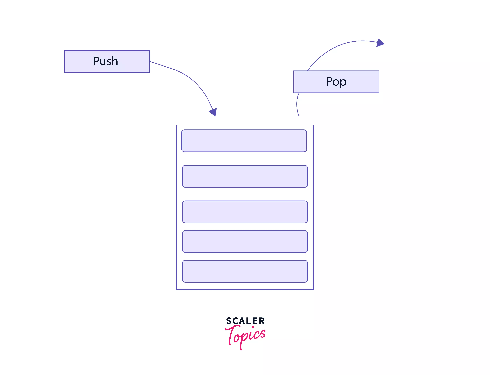

# Readings: In memory storage

## What is a ‘call’?

Execution of a function.

## How many ‘calls’ can happen at once?

One at a time.

## What does LIFO mean?

Last In, First Out

## Draw an example of a call stack and the functions that would need to be invoked to generate that call stack.

## What causes a Stack Overflow?

When the call stack exceeds its max size.

## What is a ‘reference error’?

A variable that has not been declared or not in scope.

## What is a ‘syntax error’?

A type error that is thrown when there is a typo in the code.

## What is a ‘range error’?

Thrown when trying to pass a value as an argument to a function that does not allow a range that includes the value.

## What is a ‘type error’?

Thrown when an orperation could not be preformed.

## What is a breakpoint?

Places where code execution can be stoped.

## What does the word ‘debugger’ do in your code?

It adds a breakpoint to your code to help identify coding errors.
